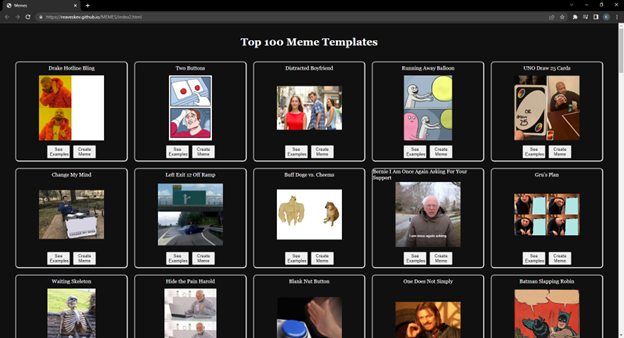

## Meme Templates

This application can be used to make or look at other Memes from the imgflip API. On the main page the user is prompted to either decide to make memes or not. Clicking the Yes "button" will result in the user being brought to another pages that list the top 100 meme templates from the API. There are two buttons next to each image. One will redirect them to a page to see other memes made in that template the other will aredirect them to a page to create memes in that specific template. IF the user presses the No "button" a window will open up showing a meme and directing the to close the windows.

### Live view

## Built with

- Semantic HTML5 markup
- CSS3
- JavaScript
- Ajax
